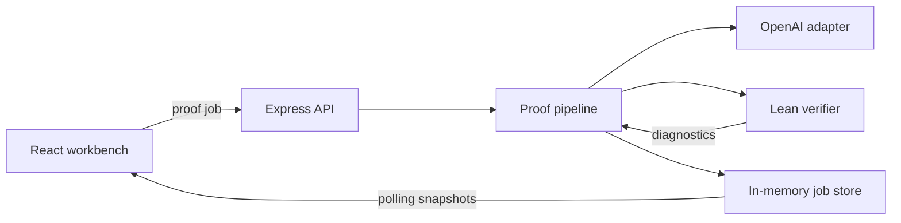
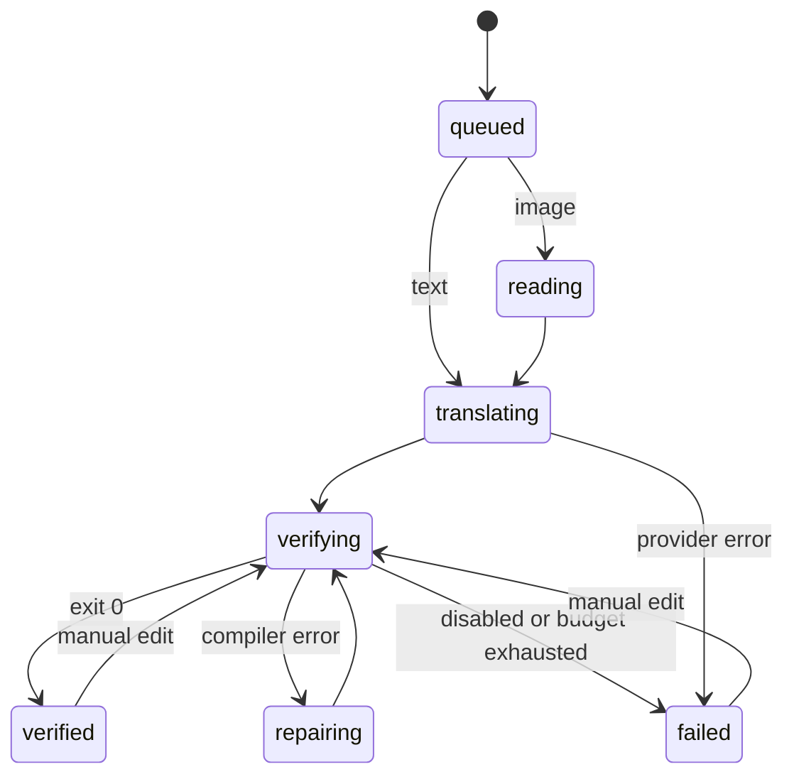

# LeanBridge Architecture

## System boundary

LeanBridge is a local single-user application. The browser is an untrusted presentation client; the Node service owns credentials, model orchestration, temporary source files, and Lean process execution.



## Module contracts

| Unit | Responsibility | Depends on |
| --- | --- | --- |
| `ProofModel` | Translate source and repair compiler failures | Shared proof types |
| `OpenAIProofModel` | Responses API multimodal requests and structured parsing | OpenAI SDK, prompt module |
| `LeanVerifier` | Verify a complete Lean source string | Shared verification types |
| `ProcessLeanVerifier` | Temporary file lifecycle and shell-free Lean process | Node process/filesystem APIs |
| `ProofPipeline` | Bounded translate → verify → repair state machine | `ProofModel`, `LeanVerifier`, store |
| `InMemoryJobStore` | Private source retention and public job snapshots | Shared job types |
| `createApp` | HTTP validation, scheduling, polling and static UI | Pipeline, public runtime config |

## Job state



Every generated or manually edited version becomes a `ProofAttempt`. A verification result is attached to that attempt. Public job responses omit the original Base64 image or full user source; the in-memory store retains it only until the server exits.

## Lean command selection

The verifier resolves the chosen project directory and checks for `lakefile.lean`, `lakefile.toml`, or `lakefile`.

| Project type | Command | Arguments |
| --- | --- | --- |
| Lake project | configured `lake` | `env`, `lean`, absolute temporary source path |
| Standalone Lean | configured `lean` | absolute temporary source path |

Commands are launched with `spawn` and `shell: false`. Output is capped at 256 KiB and the process group is terminated on timeout. The source directory is removed in `finally`.

## Model contract

The provider returns:

```ts
interface Translation {
  normalizedSource: string;
  theoremSummary: string;
  assumptions: string[];
  imports: string[];
  leanCode: string;
  notes: string[];
}
```

The server strips one accidental Markdown code fence and rejects proof placeholders. Compiler repair requests contain the normalized source, complete current Lean file, and bounded exact diagnostics. This makes individual attempts explainable and provider-independent.

## Deployment evolution

A hosted version should keep the UI and domain interfaces but replace three adapters:

1. `InMemoryJobStore` → durable database plus queue.
2. `ProcessLeanVerifier` → disposable container/microVM worker.
3. local polling API → authenticated job API with rate limits and object storage for images.

The model and verifier must remain separate trust domains: model output is always untrusted source code, and only the Lean kernel result can mark a job verified.
