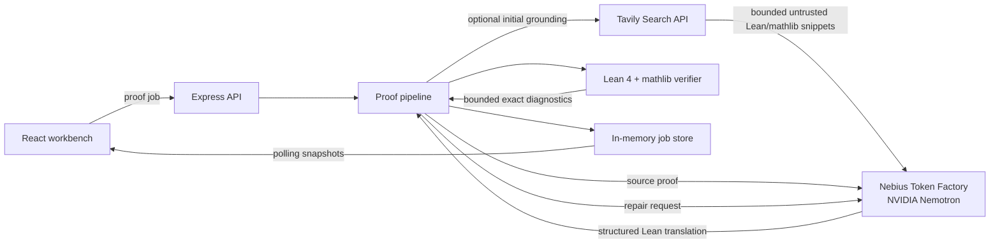
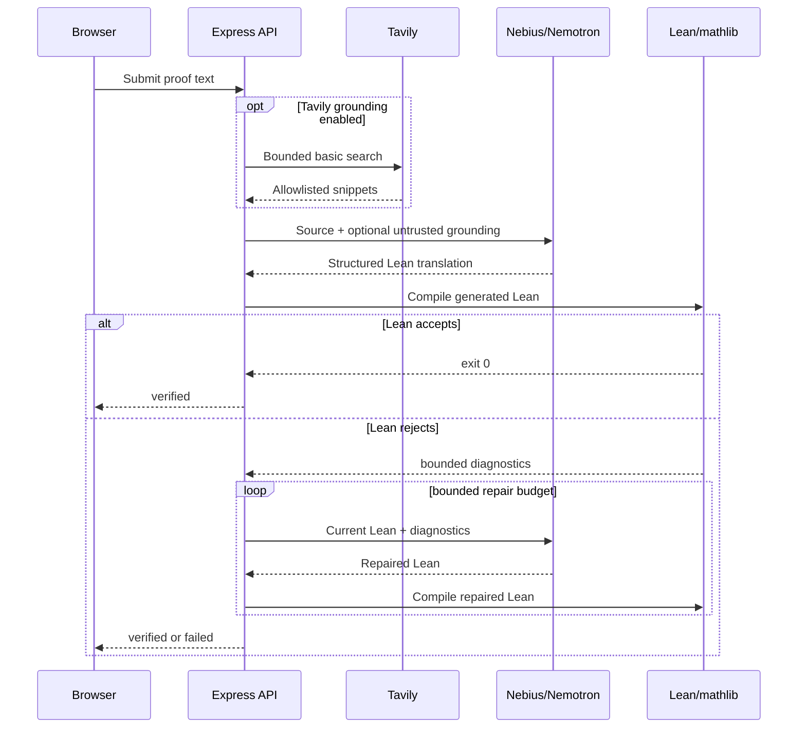
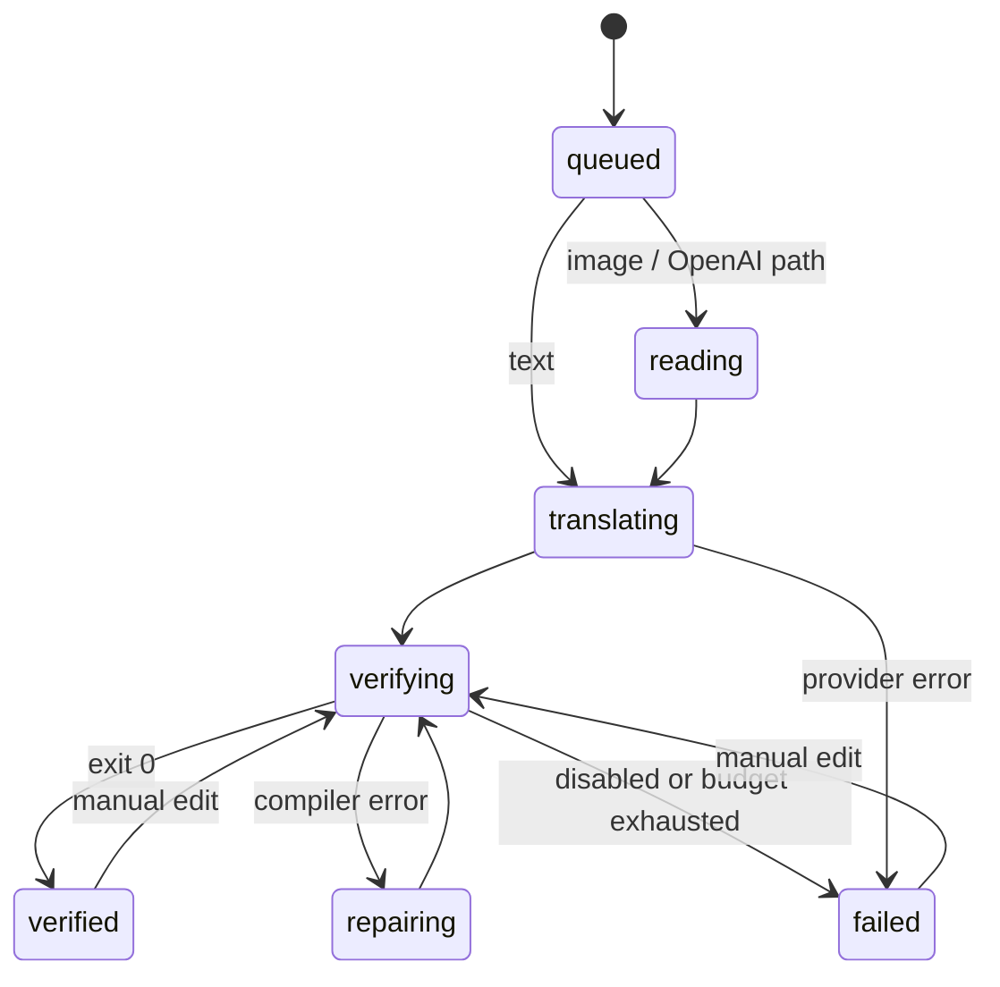

# LeanBridge Architecture

## System boundary

LeanBridge is an owner-oriented proof-formalization workbench. The browser is an untrusted presentation client; the Node service owns credentials, retrieval/model orchestration, temporary source files, and Lean process execution. The production cloud path is not presented as a hardened public multi-tenant code sandbox.

The hackathon runtime keeps three trust levels separate:

1. **Tavily retrieval** may suggest Lean/mathlib references but is untrusted context.
2. **NVIDIA Nemotron on Nebius Token Factory** may propose or repair Lean source but cannot certify it.
3. **Lean 4 + mathlib** is the deterministic verifier and the only component allowed to mark a generated proof as verified.



If Tavily grounding is disabled or its request fails, the pipeline skips retrieval and continues directly to Nemotron. Retrieval is used only before the initial translation; repair attempts use the current Lean source plus compiler diagnostics.

## Module contracts

| Unit | Responsibility | Depends on |
| --- | --- | --- |
| `ProofModel` | Translate source and repair compiler failures | Shared proof types |
| `OpenAIProofModel` | Existing multimodal OpenAI path | OpenAI SDK, prompt module |
| `NebiusProofModel` | Token Factory text translation and diagnostic-driven repair | OpenAI-compatible client, prompt module, optional `MathlibGrounder` |
| `MathlibGrounder` | Supply optional bounded reference context | Grounding interface only |
| `TavilyMathlibGrounder` | One bounded allowlisted Tavily search | `fetch`, Tavily Search API |
| `LeanVerifier` | Verify a complete Lean source string | Shared verification types |
| `ProcessLeanVerifier` | Temporary file lifecycle and shell-free Lean process | Node process/filesystem APIs |
| `SerialLeanVerifier` | Serialize Lean verification in cloud mode | `LeanVerifier` |
| `ProofPipeline` | Bounded translate → verify → repair state machine | `ProofModel`, `LeanVerifier`, store |
| `InMemoryJobStore` | Private source retention and public job snapshots | Shared job types |
| `createApp` | HTTP validation, scheduling, polling and static UI | Pipeline, public runtime config |

## Runtime data flow



## Job state



Every generated or manually edited version becomes a `ProofAttempt`. A verification result is attached to that attempt. The in-memory job store bounds retained jobs and releases image data after model processing.

## Tavily grounding boundary

The Tavily adapter is intentionally narrow:

- one search call per initial text translation;
- `search_depth: basic`;
- at most four requested results;
- bounded source/query length;
- bounded per-result and aggregate context;
- accepted URLs restricted to Lean/mathlib documentation and selected GitHub repositories;
- HTTPS only;
- no `include_answer` and no raw page content;
- retrieved text is explicitly labeled untrusted in the Nemotron prompt;
- a Tavily failure does not block the primary proof path.

This boundary is about theorem/API discovery, not truth. Retrieved content can be wrong or malicious; Lean verification remains mandatory.

## Model contract

Each provider returns the same structured shape:

```ts
interface Translation {
  normalizedSource: string;
  theoremSummary: string;
  assumptions: string[];
  imports: string[];
  leanCode: string;
  notes: string[];
}
```

The server strips one accidental Markdown code fence and rejects proof placeholders or selected compile-time execution escape hatches. Compiler repair requests contain the current Lean file and bounded exact diagnostics. This makes individual attempts explainable and keeps the domain pipeline provider-independent.

## Lean command selection

The verifier resolves the configured project directory and checks for `lakefile.lean`, `lakefile.toml`, or `lakefile`.

| Project type | Command | Arguments |
| --- | --- | --- |
| Lake project | configured `lake` | `env`, `lean`, absolute temporary source path |
| Standalone Lean | configured `lean` | absolute temporary source path |

Commands are launched with `spawn` and `shell: false`. Output is capped and the process group is terminated on timeout. Generated source lives in an application-owned temporary directory that is removed in `finally`.

## Credential boundary

The browser never receives provider keys. In Docker, the entrypoint writes OpenAI, Nebius, Tavily, and backend credentials into a temporary one-time secret file, unsets the raw environment variables, and starts Node. Node consumes and removes that file during startup. Lean subprocesses are launched with an allowlisted environment rather than inheriting model or retrieval credentials.

The public `/api/config` response exposes only capability state such as provider/model, whether Tavily grounding is enabled, and Lean mode; it does not expose secret values.

## Deployment evolution

The current hosted design is appropriate for an owner-controlled hackathon demo, not arbitrary public code execution. A public multi-tenant version should keep the UI and domain interfaces but replace or strengthen three adapters:

1. `InMemoryJobStore` → durable database plus queue.
2. `ProcessLeanVerifier` → disposable container/microVM worker with CPU/memory/network limits.
3. owner-oriented authenticated API → per-user authentication, rate limiting, audit controls, and object storage where needed.

The retrieval, model, and verifier must remain separate trust domains: Tavily context and model output are untrusted inputs, and only the Lean kernel result can mark a job verified.
